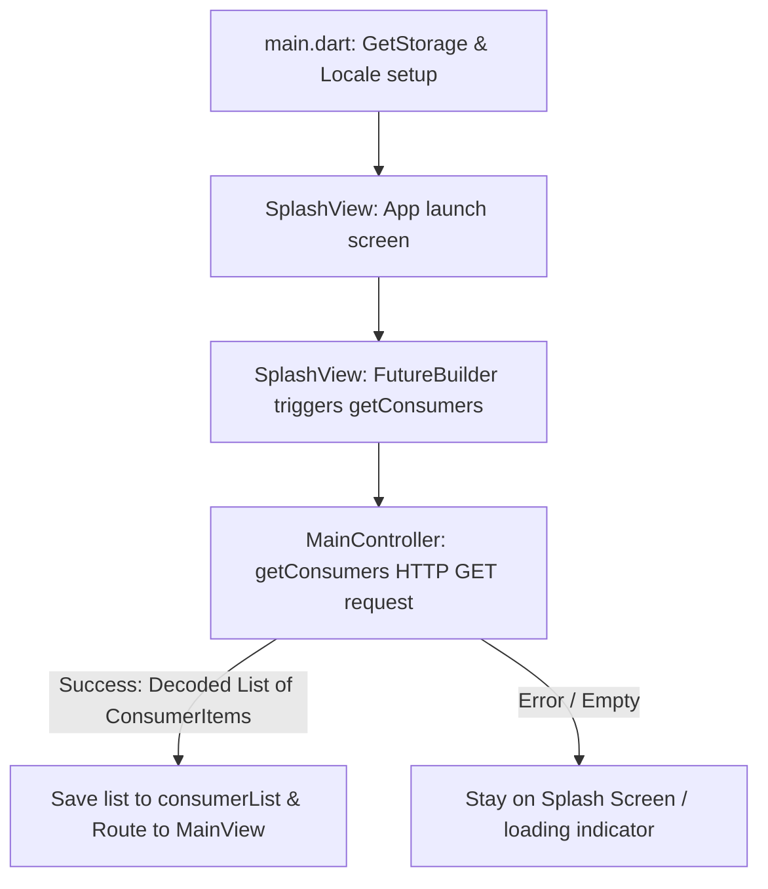
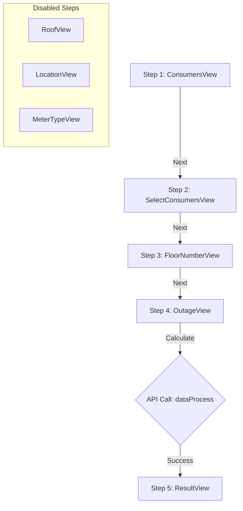

# Solar Mate - Solar Plant Estimation Wizard Flow Documentation

This document describes the structure, architecture, and step-by-step wizard flow of the **Solar Mate** (همیار خورشیدی) mobile application.

---

## 1. Project Overview & Architecture

**Solar Mate** is a utility mobile application developed in Flutter. Its primary purpose is to help residential users estimate the installation costs and equipment requirements of a residential solar plant. It achieves this by collecting details about user consumers, roof size, geographical location, meter types, and electricity outage expectations through a step-by-step wizard.

### Tech Stack
- **Framework:** Flutter (Android, iOS, Web)
- **State Management & Routing:** GetX (`GetxController`, `Obx`, `Get.off`)
- **Local Storage:** `GetStorage` (used for locale/language persistence)
- **Map Integration:** `FlutterMap` with custom tile servers
- **Location Services:** `Geolocator` (handling permissions and GPS updates)
- **HTTP client:** `http` package for webhook consumption
- **Backend Service:** n8n workflow webhook endpoints

---

## 2. API Configurations & Integrations

The app relies on two main webhook endpoints defined in [app_url_config.dart](file:///C:/Users/Ali/.gemini/antigravity/worktrees/solarmate/document-solar-wizard-flow/mobile/lib/configs/app_url_config.dart) under the base domain `https://n8n.dpnaco.com/webhook/`:

1. **`getConsumers`**: Fetches the list of all available consumer appliances (templates) with default wattages.
2. **`dataProcess`**: Processes the gathered wizard data and returns package recommendations and other costs.

---

## 3. Data Models

The app represents its state and network communication using three key data models:

### A. Consumer Item Model (`ConsumerItem`)
Defined in [consumer_model.dart](file:///C:/Users/Ali/.gemini/antigravity/worktrees/solarmate/document-solar-wizard-flow/mobile/lib/models/consumer_model.dart), this tracks both the static definitions of home appliances and their customized configuration by the user during the wizard.

| Field | Type | Description |
| :--- | :--- | :--- |
| `id` | `int` | Unique identifier for the consumer type. |
| `type` | `String` | Human-readable name of the appliance (e.g., TV, Refrigerator). |
| `normalWattage` | `int` | Operating power usage in Watts. |
| `surgeWattage` | `int` | Startup peak power usage in Watts. |
| `inverter` | `bool?` | Indicates if the appliance uses inverter technology (energy-saving). |
| `count` | `int` | The total number of this appliance owned by the user (default: 1). |
| `concurrentCount` | `int` | Number of units that might run concurrently (default: 0). |
| `isConcurrent` | `bool` | Flag stating whether the appliance is expected to run concurrently. |
| `amperControl` | `bool` | Flag indicating special current/amperage regulation constraints. |

---

### B. Wizard Payload Model (`DataModel`)
Defined in [data_model.dart](file:///C:/Users/Ali/.gemini/antigravity/worktrees/solarmate/document-solar-wizard-flow/mobile/lib/models/data_model.dart), this model collects all user inputs before submitting to the backend.

```json
{
  "selectedConsumers": [...], 
  "roofArea": "50",
  "lat": "35.6892",
  "lng": "51.3890",
  "selectedMeterType": "0",
  "floorNumber": "3",
  "selectedOutage": "0"
}
```

---

### C. Backend Output Model (`ResultModel`)
Defined in [result_model.dart](file:///C:/Users/Ali/.gemini/antigravity/worktrees/solarmate/document-solar-wizard-flow/mobile/lib/models/result_model.dart), this is returned by the `dataProcess` endpoint:
- **`packages`**: Recommended hardware configurations (inverter and panel specifications, count, type, and total price).
- **`otherCosts`**: Fixed costs like installation, structure, structural cables, etc. (name, price, description).

---

## 4. App Initialization Flow

Below is the execution flow on application startup:



1. **Locale Loading**: The app checks local storage (`GetStorage`) for a saved locale (English or Persian). If none is found, it defaults to Persian (`fa`).
2. **Pre-fetching Data**: [splash_view.dart](file:///C:/Users/Ali/.gemini/antigravity/worktrees/solarmate/document-solar-wizard-flow/mobile/lib/views/splash_view.dart) runs a `FutureBuilder` waiting on `MainController.to.getConsumers()`.
3. **Redirection**: Once consumers are loaded successfully, `Get.off(() => const MainView())` is called to launch the wizard and replace the splash screen.

---

## 5. Detailed Wizard steps (Step-by-Step)

The wizard is rendered inside [main_view.dart](file:///C:/Users/Ali/.gemini/antigravity/worktrees/solarmate/document-solar-wizard-flow/mobile/lib/views/main_view.dart) and dynamically calculates the total steps from the active controllers list. 

Currently, **Steps 3, 4, and 5 are disabled**. As a result, the active wizard has **5 sequential pages** (indexes `0` to `4`). The top bar dynamically updates the progress bar and shows the current step (e.g., `Step 1 of 5`). The bottom bar provides **Back** and **Next / Calculate / Restart** buttons.



---

### Step 1: Define Consumers (`ConsumersView`)
- **File:** [consumers_view.dart](file:///C:/Users/Ali/.gemini/antigravity/worktrees/solarmate/document-solar-wizard-flow/mobile/lib/views/consumers_view.dart)
- **Purpose**: Let the user declare which home appliances they have.
- **UI Details**:
  - A horizontal list displaying all consumer templates fetched from the backend (shows name, TV icon, normal wattage).
  - Clicking an appliance adds it to the `selectedConsumers` list.
  - Below is a vertical list of selected consumers. The user can:
    - Click **Delete (X)** to remove a consumer.
    - Adjust the total quantity (`count`) of each appliance using **`-`** and **`+`** buttons.
- **Validation**: User must select **at least one** consumer to proceed. If none are selected, clicking "Next" triggers a snackbar error: *"Please select at least one consumer"*.

---

### Step 2: Concurrent Consumers (`SelectConsumersView`)
- **File:** [select_consumers_view.dart](file:///C:/Users/Ali/.gemini/antigravity/worktrees/solarmate/document-solar-wizard-flow/mobile/lib/views/select_consumers_view.dart)
- **Purpose**: Identify appliances that will run *simultaneously* (concurrently) to calculate peak load requirement.
- **UI Details**:
  - Renders a list of the previously selected consumers.
  - Tapping a consumer item toggles its active/concurrent status (`isConcurrent`).
  - Active items highlight with a border and show **`-`** and **`+`** buttons to adjust the `concurrentCount`.
  - **Constraint**: `concurrentCount` is capped by the total quantity (`count`) defined in Step 1.
  - If `concurrentCount` is decreased to `0`, the concurrent status is disabled (`isConcurrent = false`).

---

### Step 3: Roof Area (`RoofView`) [DISABLED]
- **Status**: Disabled
- **File:** [roof_view.dart](file:///C:/Users/Ali/.gemini/antigravity/worktrees/solarmate/document-solar-wizard-flow/mobile/lib/views/roof_view.dart)
- **Purpose**: Collect the available rooftop area for solar panel layout calculations.
- **UI Details**:
  - Contains a numeric `TextField` bound to `MainController.to.roofAreaController`.
  - Suffix shows "m²" (English) or "متر" (Persian).
- **Validation**: This field is technically optional, though it's recommended for a precise panel configuration.

---

### Step 4: Location (`LocationView`) [DISABLED]
- **Status**: Disabled
- **File:** [location_view.dart](file:///C:/Users/Ali/.gemini/antigravity/worktrees/solarmate/document-solar-wizard-flow/mobile/lib/views/location_view.dart)
- **Purpose**: Get geographic coordinates (latitude and longitude) to assess average solar radiation.
- **UI Details**:
  - Marked as **"Optional"**.
  - Renders an interactive map ([FlutterMap](https://pub.dev/packages/flutter_map)) showing a red pin marker at `MainController.to.mapPoint.value`.
  - Tapping on any area of the map moves the pin and updates coordinates.
  - Includes a location permission/service header widget (`_buildLocationStatusWidget`) that updates dynamically:
    - **`disabled`**: GPS is off (shows button to open device location settings).
    - **`denied`**: Permission is rejected (shows button to request permission).
    - **`deniedForever`**: Permission permanently rejected (shows button to open app settings).
    - **`retrieving`**: Currently fetching current coordinates.
    - **`error`**: Fallback handler (shows "Try Again" button).
    - **`success`**: Dynamically focuses the map to user location.

---

### Step 5: Meter Type (`MeterTypeView`) [DISABLED]
- **Status**: Disabled
- **File:** [meter_type_view.dart](file:///C:/Users/Ali/.gemini/antigravity/worktrees/solarmate/document-solar-wizard-flow/mobile/lib/views/meter_type_view.dart)
- **Purpose**: Get grid connection characteristics (single vs three-phase) to recommend suitable grid-tied inverters.
- **UI Details**:
  - Renders three radio selection choices bound to `MainController.to.selectedMeterType`:
    - **Single-Phase (`'0'`)**
    - **Three-Phase (`'1'`)**
    - **None (`'2'`)**

---

### Step 6: Floor Number (`FloorNumberView`)
- **File:** [floor_number.dart](file:///C:/Users/Ali/.gemini/antigravity/worktrees/solarmate/document-solar-wizard-flow/mobile/lib/views/floor_number.dart)
- **Purpose**: Collect height/floor details to estimate cabling lengths and installation complexity.
- **UI Details**:
  - Marked as **"Optional"**.
  - A simple numeric `TextField` bound to `MainController.to.floorNumberController`.

---

### Step 4: Outage Expectations (`OutageView`)
- **File:** [outage_view.dart](file:///C:/Users/Ali/.gemini/antigravity/worktrees/solarmate/document-solar-wizard-flow/mobile/lib/views/outage_view.dart)
- **Purpose**: Understand backup requirements for sizing energy storage (batteries) and select hybrid vs off-grid options.
- **UI Details**:
  - Displays three choice cards bound to `MainController.to.selectedOutageIndex`:
    - **`0` - Emergencies Only (فقط مواقع اضطراری)**: Only keeps critical items like refrigerators, Wi-Fi, and lights running. ACs and heavy appliances are shut down.
    - **`1` - Heavy Usage (استفاده سنگین)**: Keeps heavy appliances (like ACs and coolers) running for up to 5 hours.
    - **`2` - Let me choose myself (خودم انتخاب می‌کنم)**: Expands a list below to let the user select specifically which appliances should be covered under battery backup (when no sun and grid support are available) and specify their quantities (similar to Step 2). These selections are serialized directly inside the corresponding items in `selectedConsumers` as `isBatteryBackup` and `batteryCount` properties.

---

### Calculation & API Trigger
When the user is on Step 4 (Outage View), the bottom-right button switches from **"Next"** to **"Calculate"** (محاسبه).
1. Clicking "Calculate" shows a loading spinner on the button.
2. An HTTP POST request is dispatched to `https://n8n.dpnaco.com/webhook/dataProcess`.
3. The request body contains `sessionId` and the serialized `DataModel`.
4. Upon receiving the response, the app deserializes the JSON response into `ResultModel`, stores it in `resultModel.value`, and navigates to the next page index.

---

### Step 8: Result View (`ResultView`)
- **File:** [result_view.dart](file:///C:/Users/Ali/.gemini/antigravity/worktrees/solarmate/document-solar-wizard-flow/mobile/lib/views/result_view.dart)
- **Purpose**: Present tailored solar packages and auxiliary/fixed costs.
- **UI Details**:
  - **Recommended Packages**: Displays all calculated configurations.
    - Tapping a package sets/toggles `selectedPackageIndex` for styling and choice capture.
    - Shows details for the inverter (name, power capacity, price), panel (name, wattage capacity, price), number of panels (`panelCount`), and total estimated price.
  - **Fixed Costs**: Shows auxiliary items (e.g. structures, wiring, labor) including name, price formatted in local currency, and descriptions.
  - Bottom button changes to **"Restart Process"** (شروع مجدد) which resets all values in the controller and navigates back to Step 1.

---

## 6. Discarded / Disabled Features

### Roof Photo Upload (`RoofPhotoView`)
- **File Reference:** [roof_photo_view.dart](file:///C:/Users/Ali/.gemini/antigravity/worktrees/solarmate/document-solar-wizard-flow/mobile/lib/views/roof_photo_view.dart)
- **Status:** Disabled / Commented out.
- **Observation:** Although the file contains UI to upload photos using `ImagePicker` from the gallery or camera, it is commented out in `MainController.pages`. Furthermore, the local file reference `selectedImage` is not integrated into `DataModel` or submitted in the `getResults` payload to the n8n backend.
